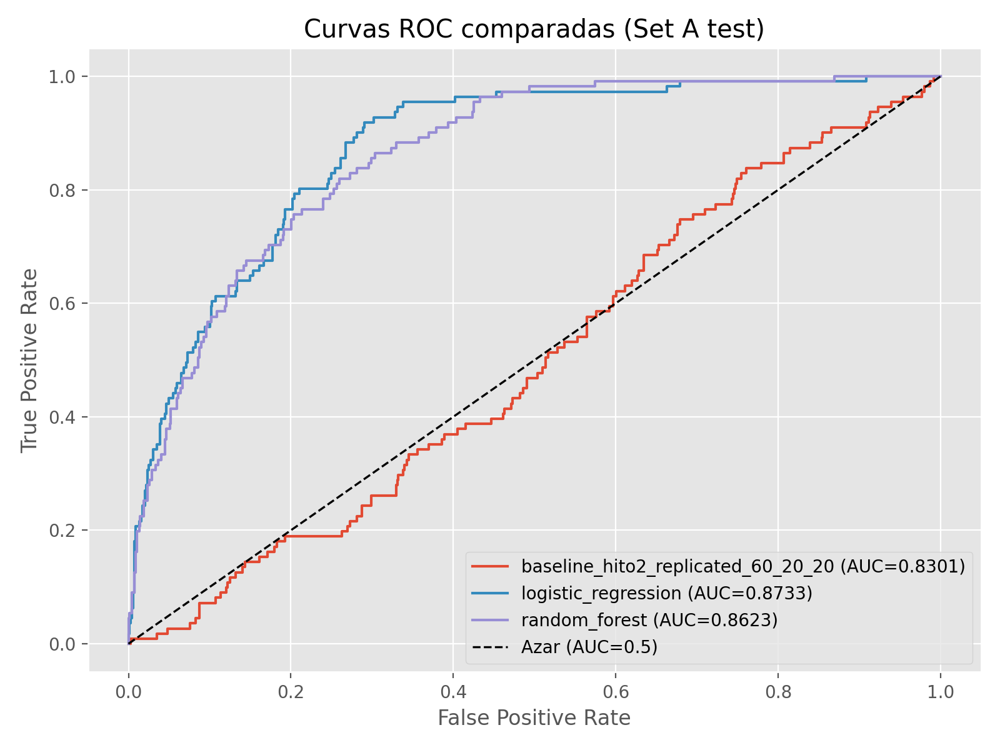
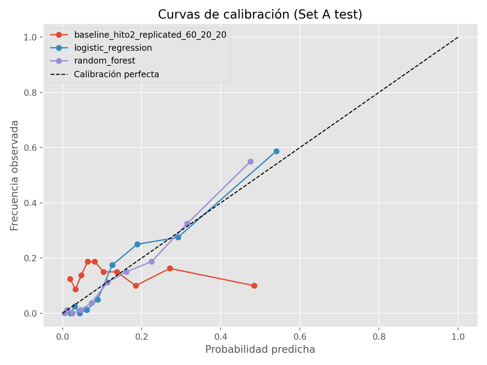
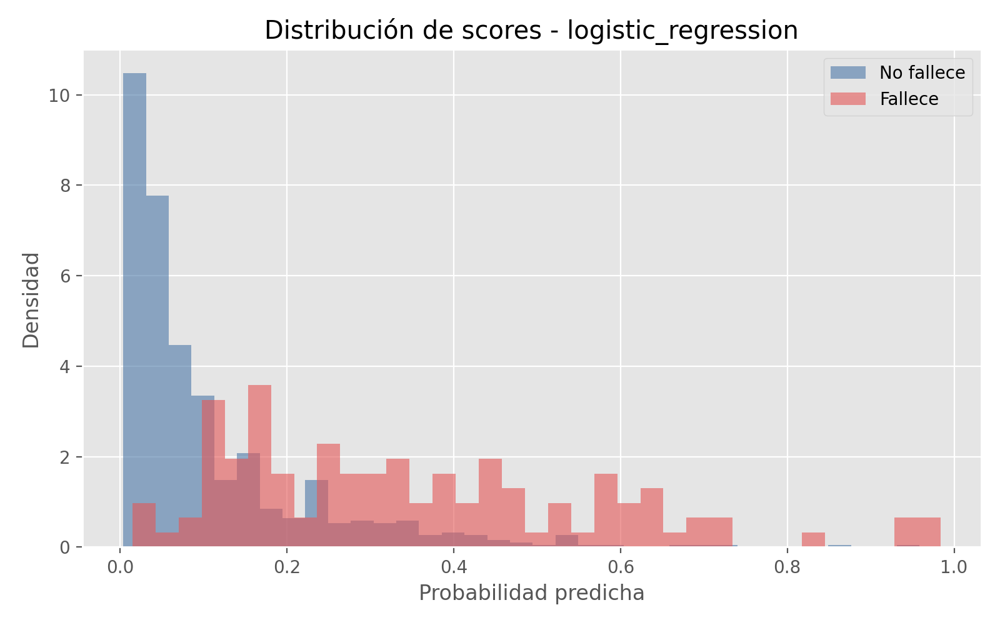
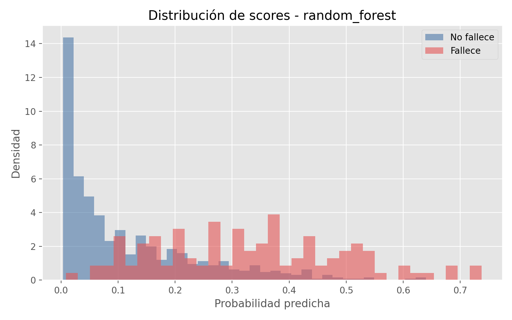

# HITO 3 — Memoria completa

## 1. Introducción

MIMIC-TRIAGE plantea la priorización temprana de pacientes de UCI mediante predicción de mortalidad intrahospitalaria usando información disponible en las primeras 48 horas desde el ingreso. El objetivo operativo no es únicamente clasificar (vive/fallece), sino generar una probabilidad de riesgo por estancia y ordenar pacientes por riesgo descendente para soportar decisiones de triaje.

El trabajo mantiene continuidad metodológica con Hito 2: mismo problema clínico, misma ventana temporal 0–48h y comparación explícita frente al baseline histórico. En Hito 3 se amplía el alcance hacia una evaluación científica reproducible con comparación entre modelos, análisis de calibración y análisis de interpretabilidad.

## 2. Estado del arte

### 2.1 Contexto clínico-metodológico

Los scores clásicos de gravedad (APACHE, SAPS, SOFA) han sido referencia para estratificación de riesgo en UCI, pero su naturaleza de reglas fijas limita la captura de no linealidades e interacciones complejas en datos clínicos heterogéneos. En consecuencia, la literatura reciente en datos tabulares de UCI combina dichos marcos clínicos con enfoques de machine learning probabilístico.

### 2.2 Benchmark PhysioNet/CinC 2012

El **PhysioNet/Computing in Cardiology Challenge 2012** define precisamente esta tarea: predecir mortalidad intrahospitalaria con datos de 0–48h. El benchmark incluye dos eventos (clasificación y riesgo/calibración) y enfatiza utilidad clínica en predicción individual.

Verificación externa utilizada en esta memoria:

- Sitio oficial del Challenge 2012 (definición de tarea, datos y scoring):
  - https://physionet.org/content/challenge-2012/1.0.0/
- Publicación introductoria del reto (CinC 2012, paper 0245):
  - http://www.cinc.org/archives/2012/pdf/0245.pdf
- Ranking final oficial del Challenge:
  - Event 1 (score de clasificación) top en torno a 0.5353.
  - SAPS-I de referencia en torno a 0.31.

**Nota de comparabilidad:** los scores oficiales del Challenge (Event 1/Event 2) no son numéricamente equivalentes a AUC-ROC/Brier, por lo que la comparación se interpreta como plausibilidad metodológica y de orden de magnitud clínico, no como igualdad métrica directa.

### 2.3 Gap abordado en Hito 3

Este Hito 3 cubre un hueco práctico: comparar modelos sobre un pipeline homogéneo 0–48h reportando simultáneamente discriminación (AUC), calidad probabilística (Brier) y utilidad operativa de triaje (Recall@k y pureza top-k).

## 3. Metodología

### 3.1 Datos y unidad de análisis

- Fuente: Set A del Challenge 2012 (4000 estancias etiquetadas).
- Unidad final: una fila por estancia UCI (`RecordID`).
- Ventana: primeras 48 horas.
- Target: `In-hospital_death`.

### 3.2 Pipeline

- Features: variables estáticas + agregados temporales 0–48h (`first`, `last`, `mean`, `min`, `max`, `std`, `n_mediciones`, `flag_medido`).
- Imputación por mediana ajustada en train.
- Escalado z-score en modelos sensibles a escala (logística).
- Evaluación con split estratificado 60/20/20 (`seed=42`) y búsqueda de hiperparámetros (`n_iter=30`).

### 3.3 Modelos comparados

- Baseline Hito 2 histórico (referencia original).
- Baseline Hito 2 replicado en split 60/20/20.
- Regresión logística (modelo lineal interpretativo).
- Random Forest (modelo no lineal por árboles).

## 4. Experimentos

### 4.1 Distribución de splits

| Split | N estancias | N fallecidos | Prevalencia (%) |
|---|---:|---:|---:|
| Train | 2400 | 332 | 13.8333 |
| Validation | 800 | 111 | 13.8750 |
| Test | 800 | 111 | 13.8750 |
| Total | 4000 | 554 | 13.8500 |

### 4.2 Figuras principales

**ROC comparada**

**Calibración comparada**

**Distribución de scores — Logística**

**Distribución de scores — Random Forest**

**Referencia EDA de Hito 2 (ejemplo de variable clínica)**

## 5. Resultados

### 5.1 Métricas globales (test)

| Modelo | AUC-ROC | Brier |
|---|---:|---:|
| Baseline Hito 2 (histórico) | 0.7806 | 0.0887 |
| Baseline Hito 2 replicado (60/20/20) | 0.8301 | 0.0985 |
| Regresión logística | **0.8733** | **0.0879** |
| Random Forest | 0.8623 | 0.0902 |

### 5.2 Métricas top-k (triaje)

| Modelo | Recall@25 | Recall@50 | Recall@100 | Recall@200 |
|---|---:|---:|---:|---:|
| Baseline Hito 2 (histórico) | 0.1684 | 0.2421 | 0.4526 | 0.6421 |
| Baseline Hito 2 replicado (60/20/20) | 0.1171 | 0.2162 | 0.4234 | 0.6667 |
| Regresión logística | **0.1802** | **0.3063** | **0.4775** | **0.7027** |
| Random Forest | 0.1622 | 0.2883 | 0.4685 | **0.7027** |

| Modelo | % fallecidos top-25 | % fallecidos top-50 | % fallecidos top-100 | % fallecidos top-200 |
|---|---:|---:|---:|---:|
| Baseline Hito 2 (histórico) | 0.64 | 0.46 | 0.43 | 0.305 |
| Baseline Hito 2 replicado (60/20/20) | 0.52 | 0.48 | 0.47 | 0.37 |
| Regresión logística | **0.80** | **0.68** | **0.53** | **0.39** |
| Random Forest | 0.72 | 0.64 | 0.52 | **0.39** |

### 5.3 Interpretabilidad

- Logística (coeficientes estandarizados): señal dominante en `GCS_mean` (negativa/protectiva), `BUN_mean` (positiva), `Age_first` (positiva), `HR_mean` (positiva).
- Random Forest (importancias): `GCS_last`, `GCS_mean`, `GCS_max`, `Urine_mean`, `BUN_last` entre las más relevantes.
- Coherencia clínica global: dominan estado neurológico y función renal/metabólica, consistente con fisiopatología de paciente crítico y con EDA de Hito 2.

## 6. Discusión

### 6.1 Comparación Hito 2 vs Hito 3

Frente al baseline histórico de Hito 2, el mejor modelo de Hito 3 (logística) mejora la discriminación global (**AUC +0.0927**) y mejora ligeramente la calidad probabilística (**Brier +0.0008**, menor error). En términos operativos, el salto en priorización temprana es notable: en top-50, la pureza sube de **0.46** a **0.68** y el recall de **0.2421** a **0.3063**.

### 6.2 Plausibilidad frente a literatura del Challenge 2012

Los resultados son plausibles para el contexto del Challenge por tres motivos:

1. Se usa la misma ventana 0–48h y variables clínicas análogas.
2. Se confirma que enfoques relativamente simples (logística bien regularizada) pueden ser muy competitivos.
3. La mejora frente a baseline tipo SAPS/lineal simple es consistente con el mensaje del propio Challenge: hay margen sustancial de mejora cuando se explota mejor la representación de variables.

### 6.3 ¿Por qué logística supera a Random Forest aquí?

En este experimento, logística supera a RF en AUC/Brier y en top-k temprano. Una explicación razonable es:

- El pipeline de agregados 0–48h ya captura señal fuerte en forma cuasi-lineal.
- El tamaño de muestra (Set A) y la prevalencia favorecen soluciones más parsimoniosas y mejor calibradas.
- RF mantiene buen rendimiento en ranking amplio (empate en Recall@200), pero con ligera pérdida de calibración probabilística.

### 6.4 Limitaciones

- Evaluación centrada en Set A (sin validación externa en cohortes adicionales).
- No se ejecutó XGBoost/SHAP en este entorno actual.
- Comparación con literatura externa es metodológica (task/scoring), no igualdad numérica exacta entre métricas heterogéneas.

### 6.5 Trabajo futuro

- Añadir XGBoost y calibración explícita post-hoc (Platt/isotónica).
- Incorporar SHAP global/local para explicabilidad por paciente.
- Evaluar estabilidad por bootstrap y, si es posible, validación externa temporal o por subcohortes de UCI.

## 7. Conclusiones

Hito 3 cierra con una comparación reproducible y clínicamente útil para triaje temprano en UCI. La regresión logística regularizada emerge como mejor compromiso entre discriminación, calibración y utilidad operativa top-k en esta configuración (`seed=42`, `n_iter=30`).

Respecto a Hito 2, el sistema mejora tanto en capacidad predictiva global como en concentración de casos de alto riesgo en la zona prioritaria del ranking, cumpliendo el objetivo principal de MIMIC-TRIAGE: priorizar mejor con información temprana y trazabilidad metodológica.

## 8. Referencias (selección mínima)

1. PhysioNet/CinC Challenge 2012 (sitio oficial): https://physionet.org/content/challenge-2012/1.0.0/
2. Silva I, Moody G, Scott DJ, Celi LA, Mark RG. Predicting In-Hospital Mortality of Patients in ICU: The PhysioNet/Computing in Cardiology Challenge 2012. CinC 2012. http://www.cinc.org/archives/2012/pdf/0245.pdf
3. Hito 2 del proyecto (documentación y EDA): `Hito 2/HITO2_TEXT.md`
4. Artefactos reproducibles de Hito 3: `Hito 3/artifacts/run_manifest.json`, `Hito 3/artifacts/tables/*.csv`, `Hito 3/artifacts/figures/*.png`
